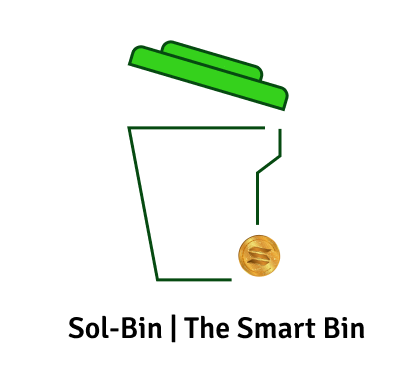

# Solbin

### What is SolBin

Sol-bin is a platform for waste management. To give context about what we are trying to solve Here is a bit background. We have municipal trucks that we need to pay for, we throw waste right on the streets, or recycling company sends their employees (Bhaiyas). Municipal trucks dumps the waste in remote area affecting nearby villages, waste on the streets is unbearable. Why this happens? There is not much incentive for people to sort the waste or recycle. What if we could incentivize them ?Introducing Sol-Bin ; a IOT and Blockchain platform where dustbin of <b>different type </b> is placed on hotspot area. For example : Dustbin that accepts paper only can be placed on university area where paper waste is highest, Dustbin accepting bottles can be placed on cafeterias and bars,  and on different locations. Now when a person throws the specific waste into specific dustbin . i.e paper into paper dustbin in university area;  through load sensing mechanism the monetary value of the waste can be found and redeemed through Solana and collection of waste can happen only if dustbin is full which can be viewed through our dashboard. Since each dustbin is meant for specific waste, we don't need middle man for sorting .Through our platform they can be managed and analytics for those dustbins can be viewed. Also a single dustbin is not going to do anything so we assume a chain of dustbins across the whole city is deployed. Once enough waste has been produced, the organization or municipality who owns those smart dustbin can create a auction for that accumulated waste and through our web interface recycling companies in that city can bid for the waste in solana blockchain.

## Steps to Run the program

### mobileApp (Next.js)

- `cd mobileFrontend\hackfestwebsite`
- `yarn install`
- `yarn dev` 

### maps (React app)

- `cd maps`
- `yarn install`
- `yarn start`

### Blockchain  

#### For Rust program
- `cd program/programs/`
- `cargo install`
- `anchor build`
- `anchor deploy`

Note: IDL has to moved to next app 

#### For Next app
- `cd blockchain/app`
- `yarn install` 
- `yarn dev`

### API server 
- `cd programs`
- `python -m venv .virtualenv`
- For linux `source .virtualenv/bin/activate`
- `pip install -r requirements.txt`
- `python manage.py runserver`

